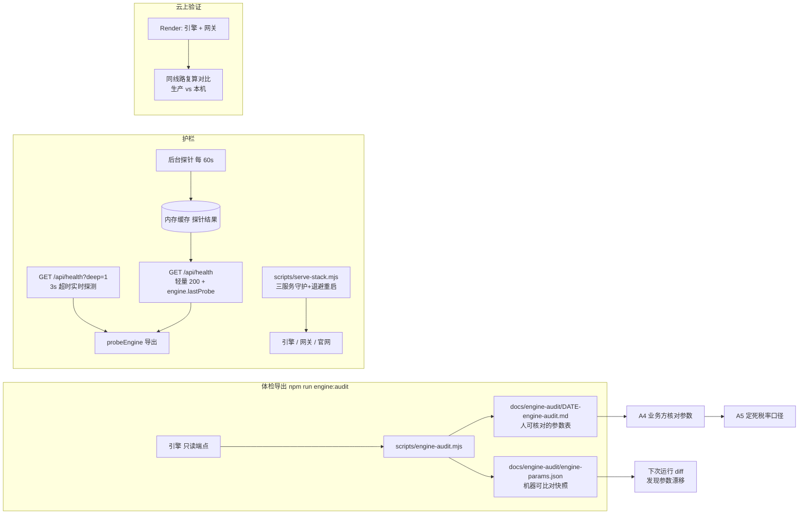

# 引擎可信度与可用性加固 —— 设计规格（A 切片）

- 日期：2026-09-25
- 状态：待主人审查（brainstorming 流程第 8 步）
- 切片归属：官网升级三连 A→B→C 中的 **A**（B = 询价线索闭环，C = AI 能力扩容，各自另出 spec）

---

## 1. 为什么做这件事

官网 `/ai` 页面上的「快速测算」会把**参考价区间**直接展示给客户（口径：引擎售价 ±10%，非正式报价）。该价格的全部输入来自 OSRM++ 引擎的参数——而 2026-09-25 的实测体检发现这些参数**没有被真实业务数据校准过**：

| 实测项 | 值 | 含义 |
|---|---|---|
| `rates/samples` | **0 条** | 引擎"按真实成交价反推"没有样本可用 |
| `rates/versions` | **0 个** | 没有可回滚的费率版本 |
| `price_factor` | `factor=1.0, active=false` | 当前用的是**基准参数**，未经校准 |
| `reference/fuel-price` | `source=manual_default` | 油价是手动默认值，未接实时源 |
| `reference/exchange-rate` | `source=file_cache`（2026-09-25 更新） | 汇率来自本机缓存文件 |
| 税率口径 | `hs-lookup` 给 ACFTA **0%**，`import-tax` 算 **5%**（同一 HS `730890`） | 两处口径不一致 |

同时发现两个可用性缺口：

1. **引擎本机运行会自行崩溃**（2026-09-25 一天内掉线 2 次；日志：Windows asyncio `OSError: [WinError 10022]`，`_ProactorBasePipeTransport._call_connection_lost`）→ 引擎一挂，官网测算直接报错。
2. **健康检查不看依赖**：引擎与网关双双掉线时，`/api/health` 依然返回 `{"status":"ok"}` → 监控发现不了。

结论：**在参数可信度与可用性被证实之前，页面上任何价格与时效相关的能力都建立在未验证的地基上。**

## 2. 目标 / 非目标

**目标**

1. 把引擎参数导出成**人能核对的表**，交业务方判断哪些是真实数据、哪些要改（含 `source`/`updated`）
2. 引擎在本机运行能**自动恢复**（崩溃不再需要人工拉起）
3. **健康检查如实反映依赖状态**（引擎挂了不能报 ok），且保活端点保持轻量快速
4. **云上（Render）实跑验证**：用生产地址复算同一条线路，与本机结果逐项对比并有书面解释
5. 明确**税率对客口径**的唯一来源

**非目标（本轮不做）**

- 不修改引擎参数值本身（校准由业务方决定并提供依据）
- 不建告警通道（邮件/飞书告警复用 B 切片的通知能力，A 阶段只用退出码 + 日志）
- 不做 CI 门禁（留待后续切片）
- 不改引擎算法、不动 AIOSRM++ 源码
- 不给客户暴露任何新的内部字段或端点（对客出参白名单不变）

## 3. 架构与组件

### 3.1 A1 参数体检导出（新增）

- 交付物：
  - `scripts/engine-audit.mjs`（新增）
  - `package.json` 增加 `"engine:audit": "node scripts/engine-audit.mjs"`
  - 运行产物：`docs/engine-audit/<YYYY-MM-DD>-engine-audit.md` + `docs/engine-audit/engine-params.json`
- 只读：脚本**不得**调用任何会改状态的端点（`*/apply`、`*/fit`、`*/import`、`*/save`、`*/refresh`、`*/rollback`、`batch/submit`、`quote/export`、`vehicles|templates` 的写方法），也不调用会花外部 API 额度的 `/api/v1/ai/*`
- 采集区块（每项都带 `source` / `updated`）：

| 区块 | 端点 | 关注点 |
|---|---|---|
| 费率 | `GET /api/v1/rates/current` | 34 车型基准价、计价口径、`price_factor`（factor/active/period） |
| 费率样本与版本 | `GET /api/v1/rates/samples`、`/rates/versions` | 条数（0 即视为未校准） |
| 汇率 | `GET /api/v1/reference/exchange-rate` | `vnd_per_rmb` + source + updated |
| 油价 | `GET /api/v1/reference/fuel-price` | `price_vnd` + source |
| 口岸费用 | `GET /api/v1/border/reference-fees`、`/border/china-side`、`/border/vietnam-side` | 中国端 / 越南端逐项 + 小计 |
| 货型系数 | `GET /api/v1/reference/cargo-types` | 6 类 `rate_multiplier` / `fuel_penalty` |
| 进出口估算 | `GET /api/v1/reference/cargo-estimates` | 每车进出口费用 |
| 车型库 | `GET /api/v1/vehicles` | 34 型号、`role` 标记 |
| 税率口径对照 | `GET /api/v1/border/hs-lookup?hs_code=<样本>` 与 `POST /api/v1/border/import-tax` | **同一 HS 两种口径并列**，差异必须显式列出 |

- 速率：引擎自带 IP 限流（实测 429「请求过于频繁」）→ 请求间隔 ≥1.6s，并对 429 采用退避重试（最多 3 次）
- 退出码：任一**关键字段缺失**或端点非 200（重试后仍失败）→ 非 0 退出并列出缺项；**不产出半张表当作成功**
- 快照 diff：与 `engine-params.json` 上一次快照对比，打印变更项（数值变化、source 变化）

### 3.2 A2 护栏

**(a) 本机引擎守护** —— `scripts/serve-stack.mjs`（新增）+ `npm run stack`

- 职责：启动并监管三个进程（引擎 `run_server.py --port 18000`、网关 `deploy/osrm-engine/server.py`、官网 `dist/server.cjs`）
- 重启策略：任一进程退出 → 记录退出码与最后一屏日志 → 退避重启（1s/2s/4s/8s/16s），**同一进程最多 5 次**；超过则停止监管并明确报错（不无限重启掩盖问题）
- 日志：每进程一个文件落在 scratch/日志目录，便于事后定位（今天崩机的证据就是这样拿到的）
- 端口前置检查：启动前确认 3300/18001/18000 空闲，被占用时明确报出占用 PID（对应「taskkill 静默失败导致所有验证跑在旧构建上」的教训）
- **云上不使用本守护**：Render 平台自带崩溃重启，避免两套重启互相打架

**(b) 健康检查如实反映依赖** —— 改 `server.ts`

- `probeEngine()`：从 `server/osrmQuote.ts` **导出复用**（不新写一套调用逻辑），带超时参数
- 后台探针：进程启动即开始，每 60s 探一次引擎 `/health`，结果（`ok` / `at` / `ms` / `reason`）存内存
- `GET /api/health`：**保持轻量、永远快速返回 200**，响应体加 `engine: { configured, base(仅域名), lastProbe: {ok, at, ms} }`；不阻塞、不实时探测（UptimeRobot 保活依赖它稳定）
- `GET /api/health?deep=1`：实时探测（3s 超时）；引擎不可达 → `status: "degraded"` + `engine.reason`（超时 / 连接失败 / 状态码）
- 兼容性：原有字段 `status` / `time` 保留；`status` 仅在没有配置引擎或深探测失败时才可能为 `degraded`，轻量模式默认 `ok`

**(c) 参数异常**：A 阶段由 A1 脚本的退出码 + 日志承担，不引入告警通道

### 3.3 A3 云上实跑验证

- 前置（业务方操作）：Render 引擎服务填 `ENGINE_API_KEY`；官网服务填 `OSRM_API_BASE`（引擎公网根地址）+ `OSRM_ENGINE_KEY`（同值）；push 前执行 `npm run sync:engine`
- 我方改动：**核对** `render.yaml` 中引擎服务的 `healthCheckPath: /health` 仍然存在（现已在位，本切片只需确认不回退，不新增配置）
- 验证：用**生产地址**复算南宁→河内 20t 拼车，与本机结果逐项对比（里程 / 行驶时长 / 车数 / 区间下上限 / `profile_honored`），差异必须能解释（例如汇率缓存时间不同、路网数据版本不同）；对比记录写入同日期的 audit 文档
- 冷启动：免费层休眠，首次请求 15–30s（官网超时已设 40s）；把生产 `/health` 加入保活

### 3.4 A4 / A5（业务方决策，非本方实现）

- A4：业务方对照 A1 的表标注参数真伪；如需导入真实成交价，提供原始数据，本方**仅做格式整理**为 `rates/template.csv` 形态，**不替代业务方编造数值**
- A5：同一 HS 的口径（ACFTA 优惠税率 vs MFN）二选一或界定适用场景，作为 C 切片对客展示的唯一依据

## 4. 接口与数据契约

| 接口 | 变化 | 契约 |
|---|---|---|
| `GET /api/health` | 扩展 | `{status: "ok"\|"degraded", time, engine: {configured: bool, base: string\|null, lastProbe: {ok: bool, at: string\|null, ms: number\|null, reason?: string}}}` |
| `GET /api/health?deep=1` | 新增 | 同上，但 `engine.lastProbe` 为本次实时结果，超时 3s |
| `server/osrmQuote.ts` | 导出 | `probeEngine(timeoutMs = 3000): Promise<{ok: boolean, ms: number, reason?: string}>` —— 与 `runQuote` **同模块**，复用既有的 `engineBase()` 与超时处理（`engineBase` 保持模块私有，不对外导出，避免出现第二套引擎地址解析） |
| `npm run engine:audit` | 新增 | 退出码 0 = 全部关键字段齐备；非 0 = 有缺项（详见 stdout） |
| `npm run stack` | 新增 | 守护三服务；全部进程到达最大重启次数仍失败 → 非 0 退出 |

**对客出参白名单不变**：`/api/osrm-quote` 返回字段集合不变，不因本切片新增任何内部字段。

### 4.1 probeEngine 契约细则（评审后补定，实现与验收脚本据此钉住）

| 项 | 规定 |
|---|---|
| `timeoutMs` | 默认 `3000`；**必须做预算归一**：非有限值或 ≤0（`0` / 负数 / `NaN` / `Infinity`）一律回落到默认值。理由：调用方会写 `Number(process.env.X)`，未配置即 `NaN`，若不归一会退化成"立刻超时"并输出**假的 `timeout`**，使运维去追一个不存在的引擎故障。**极小正值按原值使用**：`0.5` 不回落，实测引擎 ~4–30ms 回包故判 `timeout`——这是语义正确而非缺陷（`0` / `NaN` / 负数与 `0.5` 是两种不同情况，别混为一谈） |
| `reason` 取值（封闭枚举） | `not_configured`（未配 `OSRM_API_BASE`）· `timeout`（连接上但预算内无响应）· `unreachable`（连不上：拒绝/DNS/TLS，且非法 URL 也归此类，不抛异常）· `status_<HTTP码>`（可达但非 2xx，如 `status_401`、`status_404`） |
| `ms` 语义 | 实际等待毫秒；**`not_configured` 时为 `0`，含义是"未测量"而非"0 毫秒"**；`timeout` 时允许略大于预算（定时器精度） |
| 探测目标 | 打 `OSRM_API_BASE` 所指向服务的**根路径 `/health`**（不是 `/api/v1/health`）。本机配置的 base 是网关 `18001`，因此"探测引擎"实际是"探测网关及其背后的引擎" |
| **不变式** | **`/health` 必须保持免鉴权**。若未来给 `/health` 加鉴权，探测会以 `status_401` 把健康服务误报为 `degraded`；网关的 `KEY_FREE` 集合（`GET /health`、`GET /gateway/health`）是这条不变式的落点 |
| 不发密钥 | 探测**不发送** `X-API-Key`（与上面的免鉴权不变式配套）；失败时**不回传** `error.message`（含完整 URL），不打印任何 URL，避免探测自身成为信息泄漏点 |
| 覆盖要求 | 验收脚本必须覆盖四支中至少三支（`unreachable` / `not_configured` / `timeout`）+ 三种 base 写法（根地址 / 根地址带尾斜杠 / 完整 `.../api/v1`）等价性；断言必须**钉住具体 reason 取值**（仅断言"有 reason"会放过分类反转，已由变异实验证实） |

## 5. 错误处理

| 场景 | 行为 |
|---|---|
| 引擎未配置（无 `OSRM_API_BASE`） | 健康检查 `engine.configured=false`；测算接口保持既有 `engine_not_configured` 文案 |
| 引擎超时（本地探测 3s） | 深探测 `degraded`；后台探针记 `reason: timeout`；不抛出 500 |
| 引擎 429 | A1 脚本退避重试最多 3 次，仍失败则该区块标记失败并影响退出码 |
| 端点返回非预期结构 | A1 脚本判为缺项，非 0 退出（不静默跳过） |
| 守护进程反复崩 | 5 次后停止并打印最后一次日志尾部，不无限重启 |
| 引擎崩溃时客户正在测算 | 既有分支：官网返回 `engine_error` 友好文案（不暴露内部信息）——本切片不改该行为 |

## 6. 测试与验收标准

| # | 验收项 | 方法（必须真跑，不许 mock 当作通过） |
|---|---|---|
| 1 | `npm run engine:audit` 在本机真引擎跑通并产出两表 | 实跑；检查 md 含全部区块、json 可解析 |
| 2 | 缺字段即失败 | 临时指向一个只实现部分端点的地址（或用未放行的网关端口），确认非 0 退出 |
| 3 | 健康检查不谎报 | 杀掉引擎 → `?deep=1` 返回 `degraded` + reason；轻量模式 200 且 `lastProbe.ok=false`。**必须用真实 base 口径验证**（经 3300 官网 → 网关 18001 → 引擎），不得只在直连 18000 的场景下通过——否则代理层自带假 `/health` 时会漏掉误报 |
| 4 | 守护自动恢复 | `npm run stack` 下 kill 引擎 → 观察自动重启 → 测算接口重新可用 |
| 5 | 端口占用前置检查 | 手动占用 3300 → `npm run stack` 明确报出占用 PID 而非静默失败 |
| 6 | 生产 vs 本机复算 | 同一请求两侧各跑一次，差异有书面解释 |
| 7 | 对客零泄漏不回退 | 复跑 `scripts/probe-quote-api.py`（区间算法 + 内部字段零泄漏）保持全绿。**注**：该脚本原先只存在于临时目录、未入库，已随 T1 修复并入 `scripts/`（这是本验收项可执行的前提） |
| 8 | 全页回归不受影响 | `verify-agent-page.py` 390/1440 退出码 0 |

## 7. 风险与缓解

| 风险 | 缓解 |
|---|---|
| 引擎参数属 AIOSRM++ 数据资产 | 仅导出**参数值**（不含算法）；产物中不含密钥、印章、签名、银行账号；如业务方要求，可改为只出终端报告不入库 |
| Windows asyncio 崩溃可能无规律 | 守护兜底 + 记录崩溃栈；云上（Linux）规避该平台缺陷 |
| 免费层休眠使"生产 vs 本机"对比变慢 | 先 ping 生产 `/health` 唤醒，再跑对比；记录冷启动耗时 |
| 守护无限重启掩盖真 bug | 硬上限 5 次并打印日志尾部 |
| 健康检查引入新失败面 | 轻量模式绝不阻塞、绝不非 200；深探测仅按需调用 |

## 8. 交付物清单

1. `scripts/engine-audit.mjs`（新增）+ `npm run engine:audit`
2. `scripts/serve-stack.mjs`（新增）+ `npm run stack`
3. `server/osrmQuote.ts`：导出 `probeEngine()`
4. `server.ts`：`/api/health` 扩展 + `?deep=1`
5. `render.yaml`：核对引擎服务 `healthCheckPath: /health` 仍在（现已在位）
6. `docs/engine-audit/<日期>-engine-audit.md` + `engine-params.json`（产物，作为 A4 输入）
7. `DEVELOPMENT.md` 增补：体检脚本、守护用法、健康检查字段说明

## 9. 后续切片（概要，不在本 spec 范围）

- **B 询价线索闭环**：提交落库 + 邮件/飞书通知 + 全站限流 + 失败不丢单
- **C AI 能力扩容**：网关放行并接入装箱单（实测直接返回 .docx）、HS/关税查询工具（实测真实越南税表含 ACFTA/VAT）、对话闭环（结论带入询价表单）
